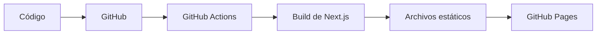

<div align="center">

# Galería Visual

**Una experiencia web interactiva, moderna y altamente visual para presentar arte, fotografía, diseño y proyectos creativos.**

[](https://nextjs.org/)
[](https://react.dev/)
[](https://www.typescriptlang.org/)
[](https://tailwindcss.com/)
[](https://pages.github.com/)

[](https://github.com/TU-USUARIO/TU-REPOSITORIO/actions/workflows/deploy.yml)

[**Ver demo**](https://TU-USUARIO.github.io/TU-REPOSITORIO/) · [Reportar un problema](https://github.com/TU-USUARIO/TU-REPOSITORIO/issues)

</div>

<!-- Vista previa: guarda una captura en public/preview.png y quita el comentario de la línea siguiente -->
<!--  -->

---

## Acerca del proyecto

**Galería Visual** es una galería web diseñada para mostrar obras de forma atractiva e inmersiva, combinando animaciones fluidas, navegación intuitiva y páginas de detalle individuales para cada pieza.

Está optimizada para funcionar como **sitio web estático**, lo que permite un despliegue rápido, sencillo y gratuito con **GitHub Pages**.

## Contenido

- [Características](#características)
- [Tecnologías](#tecnologías)
- [Estructura del proyecto](#estructura-del-proyecto)
- [Desarrollo local](#desarrollo-local)
- [Personalizar la galería](#personalizar-la-galería)
- [Despliegue en GitHub Pages](#despliegue-en-github-pages)
- [Antes de desplegar](#antes-de-desplegar)
- [Casos de uso](#casos-de-uso)
- [Licencia](#licencia)

## Características

- 🎬 **Pantalla de carga personalizada** — introducción visual mediante `gallery-loading-screen.tsx`.
- 🌀 **Presentación dinámica de obras** — experiencia interactiva con `image-stream-hero.tsx` y `works-wheel.tsx`.
- 🖼️ **Página individual para cada obra** — cada pieza tiene su propia ruta dinámica: `/obra/[id]`.
- 📱 **Diseño totalmente responsivo** — adaptado a móviles, tablets y escritorio.
- 🎨 **Estilos modernos** con Tailwind CSS.
- 🛡️ **TypeScript** con tipado estricto para mayor seguridad y mantenibilidad del código.
- ⚡ **Generación estática** configurada con `output: 'export'`.
- 🚀 **Despliegue automático** en GitHub Pages mediante GitHub Actions.

## Tecnologías

| Tecnología | Uso |
| --- | --- |
| [Next.js](https://nextjs.org/) | Framework principal |
| [React](https://react.dev/) | Construcción de la interfaz |
| [TypeScript](https://www.typescriptlang.org/) | Lenguaje y tipado |
| [Tailwind CSS](https://tailwindcss.com/) | Diseño y estilos |
| [GitHub Actions](https://github.com/features/actions) | Automatización del despliegue |
| [GitHub Pages](https://pages.github.com/) | Hosting del sitio |

## Estructura del proyecto

```text
galeria-visual-limpia/
├── .github/
│   └── workflows/
│       └── deploy.yml               # Automatización del despliegue
├── public/
│   └── images/                      # Imágenes de las obras
├── src/
│   ├── app/
│   │   ├── page.tsx                 # Página principal de la galería
│   │   └── obra/
│   │       └── [id]/                # Página dinámica de cada obra
│   ├── components/
│   │   └── ui/                      # Componentes visuales de la interfaz
│   │       ├── gallery-loading-screen.tsx
│   │       ├── image-stream-hero.tsx
│   │       └── works-wheel.tsx
│   ├── data/
│   │   └── gallery-items.ts         # Información de las obras
│   └── lib/                         # Utilidades generales
├── next.config.mjs                  # Configuración de Next.js
└── package.json
```

## Desarrollo local

### Requisitos

- [Node.js](https://nodejs.org/) (se recomienda la versión LTS)
- npm

### Instalación

1. **Clona el repositorio**

   ```bash
   git clone https://github.com/TU-USUARIO/TU-REPOSITORIO.git
   cd TU-REPOSITORIO
   ```

2. **Instala las dependencias**

   ```bash
   npm install
   ```

3. **Inicia el servidor de desarrollo**

   ```bash
   npm run dev
   ```

4. **Abre el proyecto** en [http://localhost:3000](http://localhost:3000)

### Scripts disponibles

| Comando | Descripción |
| --- | --- |
| `npm run dev` | Inicia el servidor de desarrollo |
| `npm run build` | Genera la versión estática del sitio en la carpeta `out/` |

## Personalizar la galería

Toda la información de las obras está centralizada en un único archivo, así que puedes cambiar el contenido **sin tocar los componentes visuales**.

### Añadir o editar obras

Edita `src/data/gallery-items.ts` para añadir, modificar o eliminar obras:

```ts
{
  id: "mi-obra",
  title: "Mi Obra",
  description: "Descripción de la obra",
  image: "/images/mi-obra.jpg",
}
```

> [!NOTE]
> La estructura exacta de cada objeto depende de los campos definidos actualmente en `gallery-items.ts`.

### Añadir imágenes

Guarda las imágenes dentro de la carpeta pública del proyecto:

```text
public/
└── images/
    ├── obra-1.jpg
    ├── obra-2.jpg
    └── obra-3.jpg
```

Y referéncialas desde los datos de la galería:

```ts
image: "/images/obra-1.jpg"
```

También puedes usar URLs externas válidas si la estructura de datos del proyecto lo permite.

## Despliegue en GitHub Pages

El proyecto usa **GitHub Actions** para generar y publicar automáticamente la versión estática del sitio. El workflow está en `.github/workflows/deploy.yml` y Next.js está configurado con `output: 'export'` para producir los archivos estáticos.



### Activar GitHub Pages

1. Sube el código a tu repositorio en GitHub.
2. Ve a **Settings → Pages**.
3. En **Build and deployment → Source**, selecciona **GitHub Actions** (o la rama que publique tu workflow, si usa una como `gh-pages`).
4. Cada vez que envíes cambios al repositorio, el workflow se ejecutará y publicará el sitio según los eventos configurados en `deploy.yml`.

> [!IMPORTANT]
> Si el sitio se publica en una subruta, como `https://TU-USUARIO.github.io/TU-REPOSITORIO/`, revisa `next.config.mjs`: normalmente hace falta definir `basePath` y desactivar la optimización de imágenes para la exportación estática.

<details>
<summary>Ver ejemplo de <code>next.config.mjs</code></summary>

```js
/** @type {import('next').NextConfig} */
const nextConfig = {
  output: 'export',
  basePath: '/TU-REPOSITORIO',
  images: { unoptimized: true },
};

export default nextConfig;
```

</details>

## Antes de desplegar

- [ ] Revisa la configuración de `next.config.mjs`.
- [ ] Comprueba las rutas de las imágenes (incluido el `basePath`, si lo usas).
- [ ] Revisa el contenido de `src/data/gallery-items.ts`.
- [ ] Verifica la configuración de GitHub Pages en el repositorio.
- [ ] Revisa el workflow en `.github/workflows/deploy.yml`.

## Casos de uso

Galería Visual ofrece una base moderna y flexible para crear experiencias digitales centradas en contenido visual. Puedes usarla para:

- Portafolios de artistas
- Portafolios de fotografía
- Proyectos de diseño
- Galerías digitales
- Portafolios profesionales
- Proyectos creativos y personales

## Licencia

Este proyecto puede usarse y modificarse según los términos de la licencia incluida en el repositorio. Consulta el archivo [`LICENSE`](LICENSE) para más detalles.

<!-- Recordatorio: si el proyecto todavía no incluye una licencia, añade una antes de distribuirlo públicamente. -->

---

<div align="center">

[Volver arriba ↑](#galería-visual)

</div>
